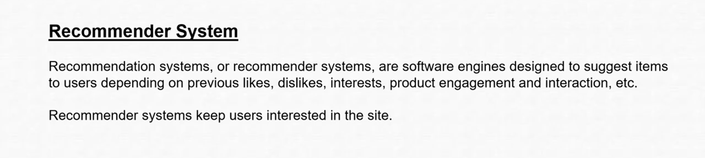
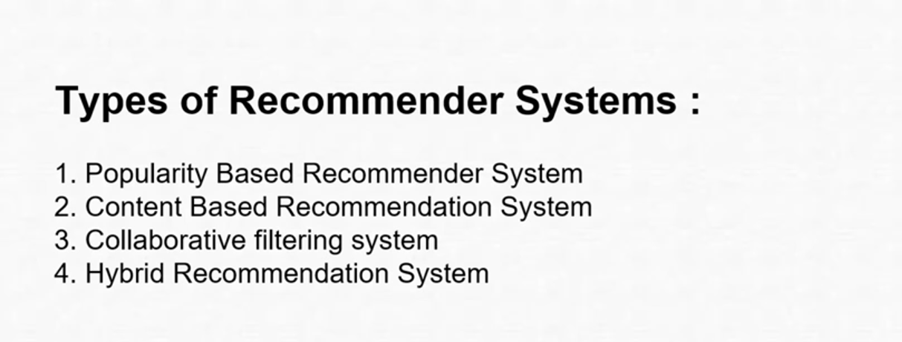
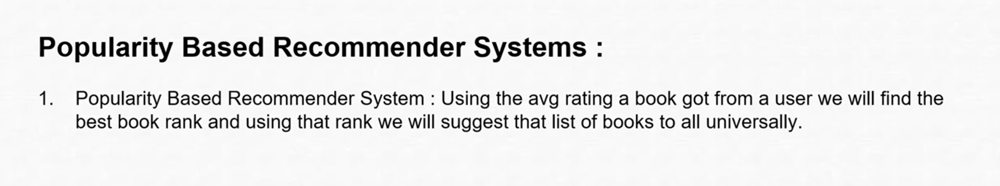
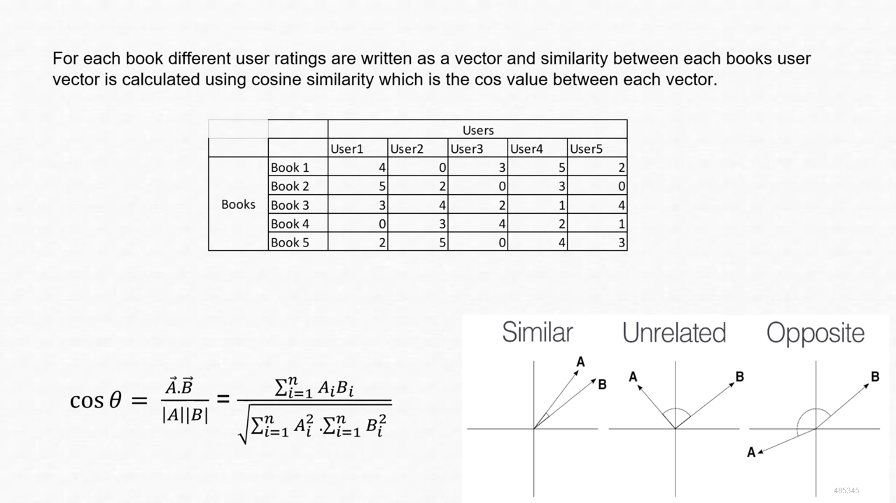
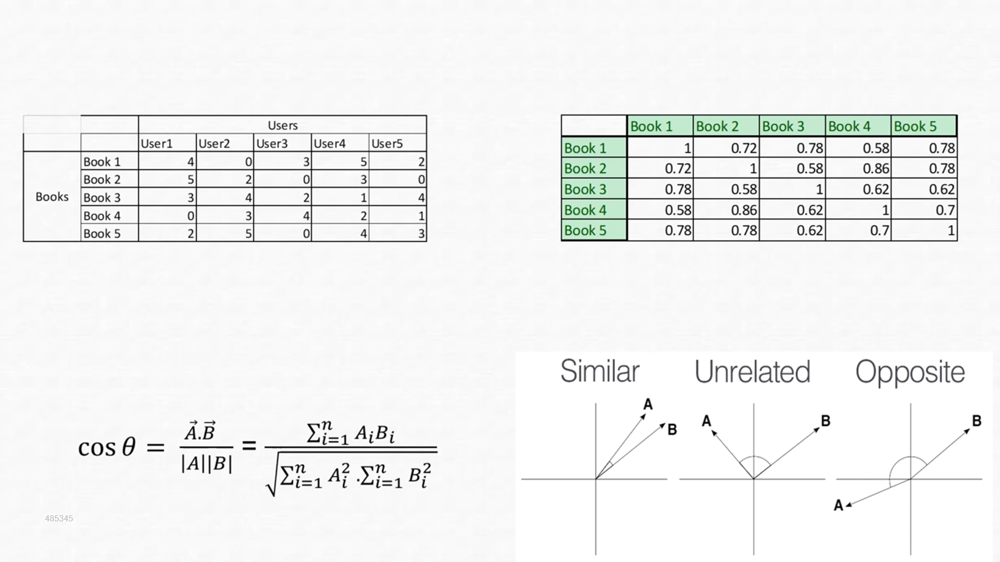
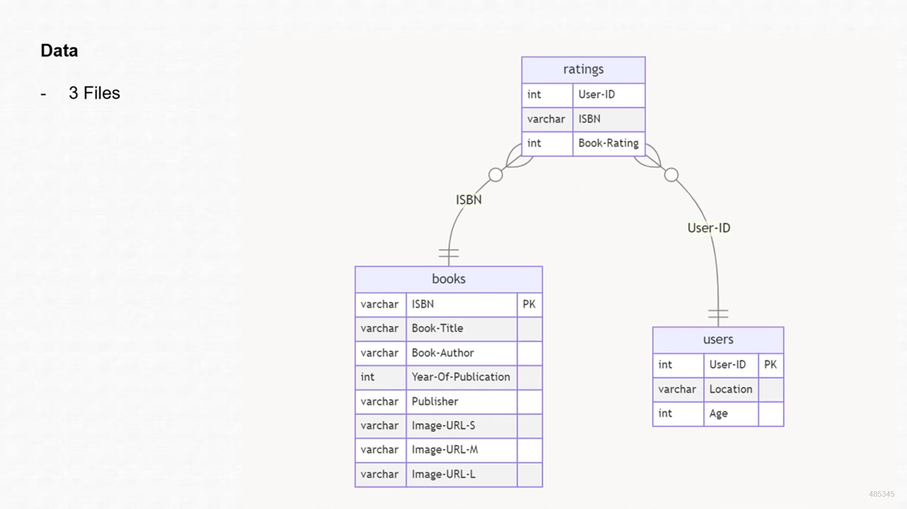

# Personalized Book Recommender

The primary objective of this project is to develop a  book recommendation system based on historical data to provide personalized book suggestions,aims to enhance the reading experiences of users by recommending books that align closely with their preferences and interests.

The project involves analyzing the book dataset obtained from Kaggle using Python and Jupyter Notebook. The analysis will utilize libraries such as pandas for data manipulation, cosine similarity is used  to find the similarity between the books,and the model will be saved using the pickle library. Streamlit will be used to create an interactive web application that allows users to input book details and recive the recommdations.
## Features

- **Personalized Recommendations:** Provides book suggestions based on user input.
- **Cosine Similarity:** Utilized to measure similarity between books.
- **Interactive Web Application:** Built with Streamlit for a user-friendly interface.
- **Efficient Data Processing:** Uses Python libraries for seamless data manipulation and analysis.

## Project Workflow

1. **Dataset Analysis:**
   - Dataset sourced from [Kaggle](https://www.kaggle.com/datasets/arashnic/book-recommendation-dataset).
   - Data cleaned and preprocessed using pandas.

2. **Similarity Computation:**
   - Cosine similarity technique applied to find similar books.

3. **Model Serialization:**
   - Model saved using the `pickle` library for reuse.

4. **Web Application:**
   - Interactive app developed with Streamlit to take user input and display recommendations.

## Technologies Used

- **Python:** Programming language for data analysis and model building.
- **Jupyter Notebook:** For experimentation and visualization.
- **pandas:** Library for data manipulation.
- **cosine_similarity:** To compute book similarities.
- **pickle:** For saving the model.
- **Streamlit:** Framework for building the web app.

## Installation

1. Clone the repository:
   ```bash
   git clone https://github.com/your-username/personalized-book-recommender.git
   ```

2. Navigate to the project directory:
   ```bash
   cd personalized-book-recommender
   ```

3. Install the required dependencies:
   ```bash
   pip install -r requirements.txt
   ```

## Usage

1. Run the Streamlit application:
   ```bash
   streamlit run app.py
   ```

2. Input book details in the web app to receive personalized recommendations.

## Dataset

The dataset used for this project is sourced from [Kaggle](https://www.kaggle.com/datasets/arashnic/book-recommendation-dataset). Ensure the dataset is placed in the `data` directory before running the application.

### Content of the Dataset

#### Users

Contains user details with anonymized IDs. Demographic data includes:
- **User-ID:** Unique identifier for the user.
- **Location:** User's location.
- **Age:** User's age.

#### Books

Books are identified by their ISBN. Additional attributes include:
- **ISBN:** Unique identifier for the book.
- **Book-Title:** Title of the book.
- **Book-Author:** Author of the book.
- **Year-Of-Publication:** Year the book was published.
- **Publisher:** Publisher of the book.
- **Image-URL-S/M/L:** URLs linking to small, medium, and large book cover images.

#### Ratings

Contains user ratings for books:
- **User-ID:** Identifier for the user.
- **ISBN:** Identifier for the book.
- **Book-Rating:** Rating on a scale of 0-10.

## Directory Structure

```
personalized-book-recommender/
├── data/                # Contains the Kaggle dataset
├── notebooks/           # Jupyter Notebooks for analysis
├── app.py               # Streamlit application
├── model.pkl            # Serialized model file
├── requirements.txt     # Dependencies
└── README.md            # Project documentation
```

## Future Enhancements

- Incorporate user feedback to refine recommendations.
- Expand the dataset for broader book coverage.
- Add genre-based filtering for more precise suggestions.

## Recommender Systems Overview

### What are Recommender Systems

- Recommendation systems, or recommender systems, are software engines designed to suggest items to users depending on previous likes, dislikes, interests, product engagement, and interaction.
- Recommender systems keep users interested in the site.

### Examples of Recommender Systems

- **OTT Platforms**:
  - Amazon Prime
  - Netflix
  - Hotstar
  - Jio Cinema

- **Music Apps**:
  - Spotify
  - Wynk
  - Jio Saavan
  - Apple Music

- **Food Apps**:
  - Zomato
  - Swiggy

- **Instant Delivery Apps**:
  - Zepto
  - Blinkit
  - Big Basket

- **Social Media**:
  - Instagram
  - Facebook
  - YouTube
  - YouTube Shorts
  - TikTok
  - Twitter

- **Shopping Platforms**:
  - Flipkart
  - Myntra
  - Amazon

- **Medical Delivery Apps**:
  - 1mg
  - Medplus
  - Apollo

### Why Recommender Systems

1. **To Increase Sales**:
   - Benefits the company by increasing revenue.
2. **To Decrease Load on the System**:
   - Suggestions reduce the need for continuous searching.
3. **To Increase Engagement and Satisfaction**:
   - More engagement leads to better user experience and business success.

### Types of Recommender Systems

#### 1. Popularity-Based Recommendation System

- Suggests items based on their overall popularity.
- Examples:
  - Trending section on YouTube.
  - Top 100 IMDb movies.
  - Top songs of the year.

#### 2. Content-Based Recommendation System

- Recommends items similar to those the user has shown interest in.
- Relies on item attributes or features.

#### 3. Collaborative Filtering

- Makes predictions based on the preferences of other users.
- Types:
  - **User-Based Collaborative Filtering**:
    - Recommends items based on preferences of similar users.
  - **Item-Based Collaborative Filtering**:
    - Recommends items based on similarities between items.

#### 4. Hybrid Recommender System

- Combines multiple techniques to improve recommendations.
- Mix of content-based, collaborative filtering, and other methods like demographic or knowledge-based approaches.

## References

- **Dataset Link:** [Kaggle Dataset](https://www.kaggle.com/datasets/arashnic/book-recommendation-dataset)
- **Website:** [Visit the project website](https://example.com/personalized-book-recommender)
- **Demo Video:** [Watch the project demo](https://example.com/demo-video)

### Reference Images

1. 
2. 
3. 
4. 
5. 
6. 
7. 
8. 


## License

This project is licensed under the [MIT License](LICENSE).

## Contributions

Contributions are welcome! Feel free to open issues or submit pull requests to improve the project.


